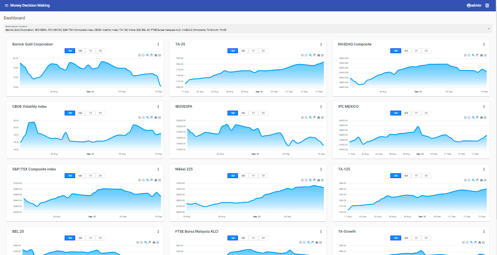

# MDM - Money Decision Making

## Build on
* Java 16, Framework Spring Boot 2.5.4
* Angular 12.1.1, Framework Angular Material
* Gradle 7.2

## Feature
* Dashboard show all graphs
* Decisions - next release
* User Administration (User/Roles)
* Activity Log

## Demo

## Run dev
> Run `MoneyDecisionMakingApplication.java`

> Execute gradle Task `:frontend:runDevProxy`
### Open
> http://<remote_ip>:4200 (admin/admin)

## Run production
> Execute gradle Task `Task :backend:bootJar`

> Run command `java -jar backend-0.0.1-SNAPSHOT.jar`
### Open
> http://<remote_ip>:8080 (admin/admin)
